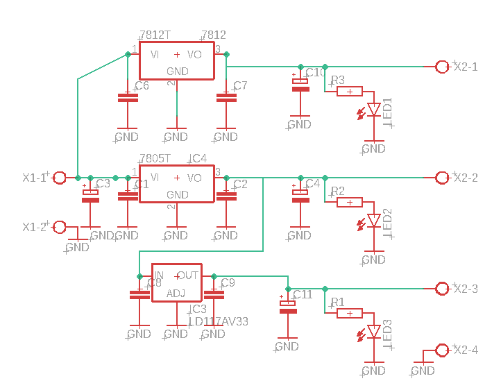
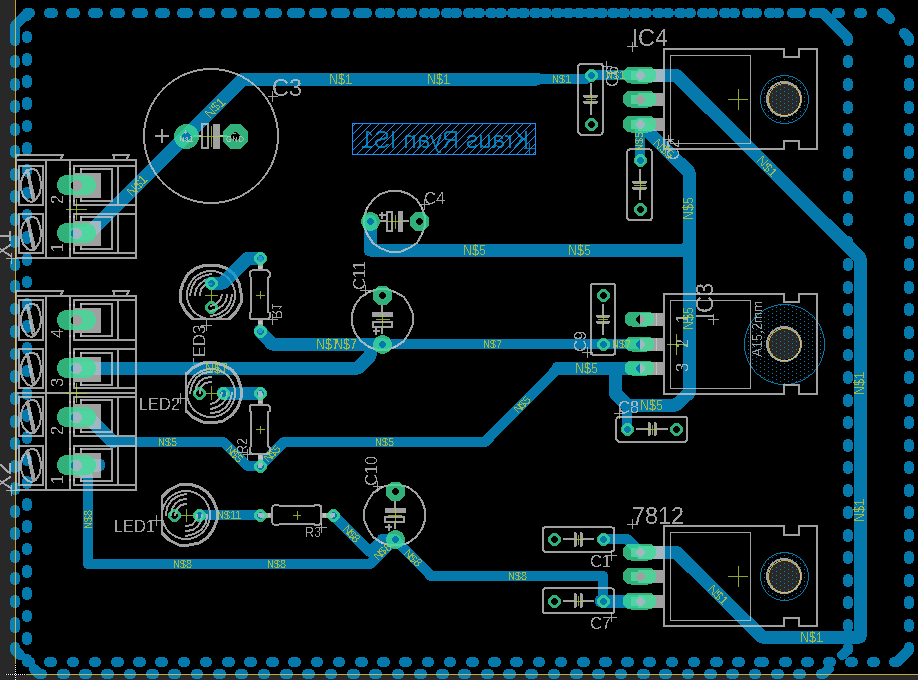
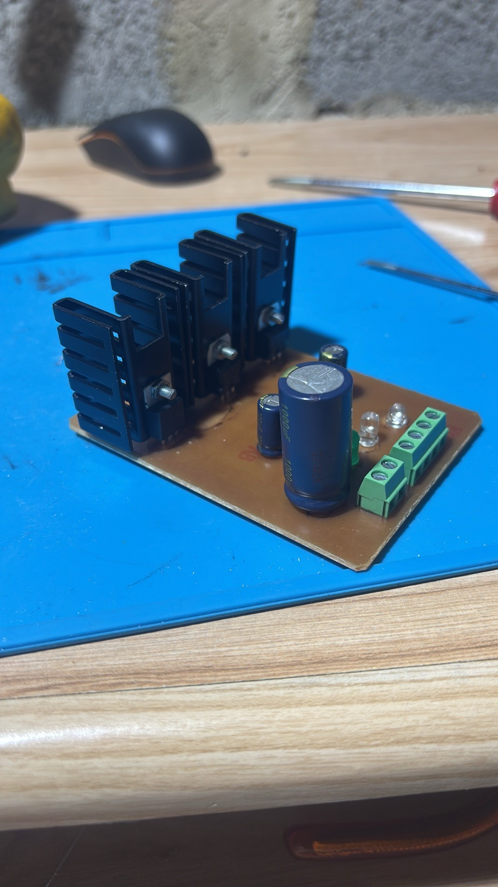

# 🔌 Multi-Output Voltage Regulator (3.3V / 5V / 12V)

## 📌 Overview

This project is a **compact analog voltage regulator module** designed to provide three independent regulated outputs: **3.3V, 5V, and 12V**.  

It allows flexible input/output routing and integrates an **IRL MOSFET power stage** to handle higher currents reliably. The design is modular and can be easily integrated into other analog systems or DIY electronics projects.

---

## ⚙️ Features

- Three regulated voltage outputs: **3.3V, 5V, 12V**
- Independent input/output connections
- High-current handling with IRL MOSFET
- Compact PCB layout suitable for integration
- Fully analog design (no microcontrollers)
- Modular and flexible for different projects

---

## 📷 Screenshots

### Schematic (work in progress)

### PCB Layout

### Power Stage with IRL MOSFET

---

## 🛠️ Technical Specifications

- Input voltage: depends on desired regulation range (ensure Vin > Vout + dropout)
- Output voltages: 3.3V, 5V, 12V
- Output current: determined by MOSFET and heat dissipation
- Regulation type: linear / LDO style
- Analog protection and filtering included
- PCB designed for modular integration

---

## 🎯 Objectives

- Provide multiple regulated voltages from a single module
- Ensure stable outputs for analog and digital systems
- Offer a flexible, high-current design for DIY projects
- Document the design with schematics and PCB screenshots for reference

---

## 🚀 Future Improvements

- Test and optimize thermal performance
- Validate load stability and voltage ripple
- Add overcurrent and overvoltage protection
- Modular expansion for additional voltage rails
- Create a ready-to-use kit for hobbyists and engineers

